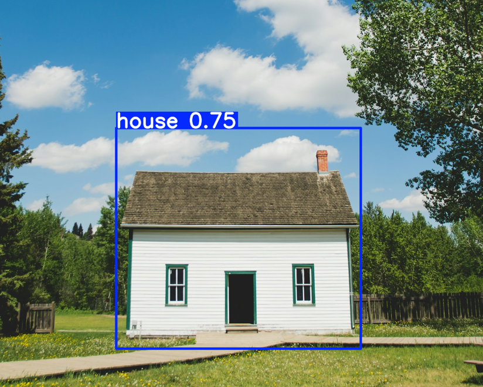
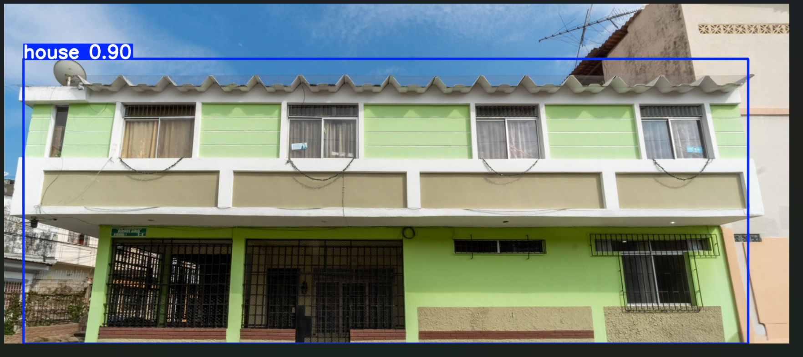
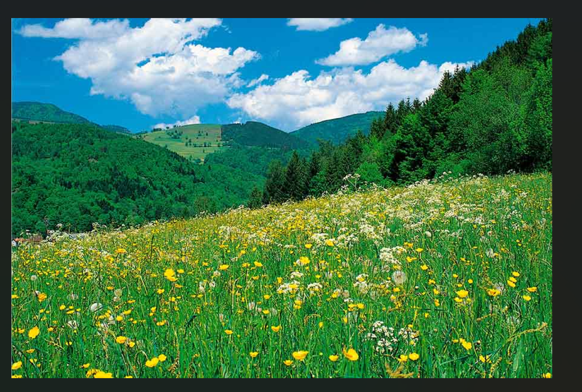

# taller-yolo-deteccion-casas-LRS


# House Detection with YOLOv8

Este proyecto implementa un sistema de **detección de casas en imágenes** utilizando el modelo **YOLOv8**.  
El objetivo es entrenar un detector capaz de identificar la clase **House** en diferentes escenarios y evaluar su desempeño utilizando métricas estándar de visión por computador.

---

# Estructura del Proyecto

```
taller-yolo-deteccion-casas-LRS
│
├── dataset
│   ├── images
│   │   ├── train
│   │   └── val
│   └── labels
│       ├── train
│       └── val
│
├── docs
│   └── images
│       ├── detection1.png
│       ├── detection2.png
│       └── no_detection.png
│
├── models
│   └── house_detector
│       └── weights
│           └── best.pt
│
├── src
│   ├── train_yolo.py
│   ├── inferencia.py
│   ├── api.py
│   └── utils.py
│
├── data.yaml
├── requirements.txt
└── README.md
```

---

# Instalación

Primero clonar el repositorio o descargar el proyecto.

Luego instalar las dependencias necesarias:

```bash
pip install -r requirements.txt
```

### requirements.txt

El archivo `requirements.txt` debe contener:


---

# 📊 Dataset

El dataset contiene aproximadamente **100 imágenes de casas** recopiladas de fuentes públicas en internet.

Las imágenes fueron **etiquetadas manualmente** utilizando bounding boxes para la clase:

```
House
```

El dataset está dividido en:

- **Train:** entrenamiento del modelo
- **Validation:** evaluación del modelo

Formato de anotación utilizado: **YOLO**

---

# 🧠 Entrenamiento del Modelo

El modelo se entrena utilizando **YOLOv8** de la librería `ultralytics`.

Para entrenar el modelo ejecutar:

```bash
python src/train_yolo.py
```

Los pesos entrenados se guardan en:

```
models/house_detector/weights/best.pt
```

---

# 🔎 Inferencia

Para realizar detección sobre una imagen utilizando el script de inferencia:

```bash
python src/inferencia.py
```

El script cargará el modelo entrenado y detectará la clase **House** en la imagen proporcionada.

---

# 🌐 Despliegue con FastAPI

Se implementó un **endpoint simple utilizando FastAPI** que permite enviar una imagen y obtener como respuesta la misma imagen con las detecciones realizadas por el modelo.

## Ejecutar la API

Desde la carpeta raíz del proyecto ejecutar:

```bash
uvicorn src.api:app --reload
```

El servidor se iniciará en:

```
http://127.0.0.1:8000
```

---

## Usar la API

FastAPI genera automáticamente una interfaz interactiva.

Abrir en el navegador:

```
http://127.0.0.1:8000/docs
```

Pasos para usar la API:

1. Abrir `/predict`
2. Subir una imagen
3. Ejecutar la petición
4. El sistema devolverá la imagen con las **bounding boxes y scores del modelo**

Esto permite probar el modelo sin necesidad de modificar código en VS Code.

---

# 📈 Evaluación del Modelo

El modelo fue evaluado utilizando el conjunto de validación.

| Métrica | Valor |
|-------|------|
| Precision | 0.71 |
| Recall | 0.47 |
| mAP@0.5 | 0.46 |

### Interpretación

- **Precision (0.71):** aproximadamente el 71% de las detecciones realizadas corresponden correctamente a casas.
- **Recall (0.47):** el modelo detecta cerca del 47% de todas las casas presentes en el dataset de validación.
- **mAP@0.5 (0.46):** indica una coincidencia moderada entre las bounding boxes predichas y las anotaciones reales.

Estos resultados son razonables considerando el tamaño reducido del dataset.

---

# 🖼️ Ejemplos de Detección

### Detección correcta (casa grande)



### Detección correcta (casa pequeña)



### Imagen sin casas (sin detección)



---

# ⚠️ Limitaciones

El dataset utilizado es relativamente pequeño (≈100 imágenes), lo que puede limitar la capacidad de generalización del modelo.

Esto puede provocar:

- falsos negativos
- dificultad para detectar casas en escenas complejas
- sensibilidad a cambios fuertes de escala o iluminación

---

# 🚀 Trabajo Futuro

Posibles mejoras para el modelo:

- aumentar el tamaño del dataset
- aplicar técnicas de **data augmentation**
- mejorar la calidad de las anotaciones
- utilizar arquitecturas más grandes de YOLO
- evaluar el modelo en datasets más diversos

---

# 🛠 Tecnologías Utilizadas

- Python
- YOLOv8 (Ultralytics)
- PyTorch
- FastAPI
- OpenCV